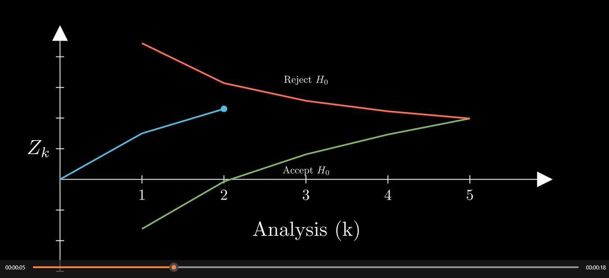
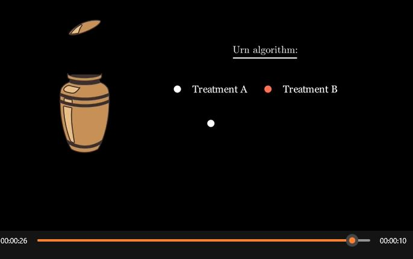
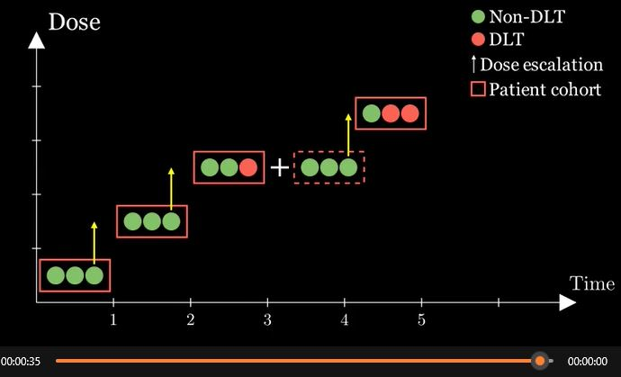
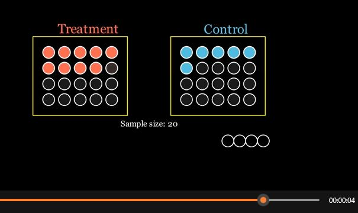

# Manim Examples

A collection of manim examples relating to trial designs to modify/use. Outputs are shown in /Videos

## Table of Contents

* [Installation](#Manim-Installation)
* [Examples](#Example-Previews)
    * [Group Sequential Trial](#Boundary-Animation)
    * [Dose Escalation Design](#3+3-Dose-Escalation)
    * [Simple Randomisation](#simple-randomisation)
## Manim Installation

See the documentation here for installation instructions:

https://docs.manim.community/en/stable/


## Example Previews

### Boundary Animation

Animation of a group-sequential trial with 5 analyses with stopping for futility and efficacy.

```python
class BoundaryAnimation(Scene):
    def construct(self):
        # Define k values and boundaries (boundaries start at k=1)
        k_values = np.array([0, 1, 2, 3, 4, 5])
        a_crit = np.array([-1.61511306, -0.07126633, 0.81610852, 1.46393433, 1.986610])  # No k=0 boundary
        b_crit = np.array([4.442196, 3.141107, 2.564703, 2.221098, 1.986610])  # No k=0 boundary

        # Observed paths (starting from k=0, y=0)
        observed_red_cross = np.array([0, 1.5, 2.3, 2.7, 4.5])  # Crosses upper boundary
        observed_green_cross = np.array([0, -1.2, -1.8, -2.2, -2.5])  # Crosses lower boundary
        observed_no_cross = np.array([0,1.8, 1, 1.5, 1.8, 2.1])  # Stays within bounds

        # Create axes
        axes = Axes(
            x_range=[0, 6, 1],
            y_range=[-3, 5, 1],
            axis_config={"color": WHITE},
            x_axis_config={
                "numbers_to_include": [1, 2, 3, 4, 5],  # Only show ticks for x values from 1 to 5
            }
        )
        x_label = Tex("Analysis (k)").next_to(axes.x_axis, DOWN, buff=0.5)
        y_label = MathTex("Z_k").next_to(axes.y_axis, LEFT, buff=0.1)
        
        self.play(Create(axes), Write(x_label), Write(y_label))

        # Plot boundaries (starting at k=1)
        a_crit_line = axes.plot_line_graph(
            x_values=k_values[1:], y_values=a_crit, add_vertex_dots=False, line_color=GREEN, stroke_width=4
        )
        b_crit_line = axes.plot_line_graph(
            x_values=k_values[1:], y_values=b_crit, add_vertex_dots=False, line_color=RED, stroke_width=4
        )
        self.play(Create(a_crit_line), Create(b_crit_line))
        # Labels on graph
        reject_text = MathTex(r"\text{Reject } H_0", font_size=24)
        reject_text.move_to(axes.c2p(3, b_crit[2]) + UP * 0.5)
        self.play(Write(reject_text))

        accept_text = MathTex(r"\text{Accept } H_0", font_size=24)
        accept_text.move_to(axes.c2p(3, a_crit[2]) + DOWN * 0.4)
        self.play(Write(accept_text))

        # Function to animate each scenario
        def animate_path(observed_values):
            observed_dot = Dot(axes.c2p(k_values[0], observed_values[0]), color=BLUE)
            self.add(observed_dot)

            prev_point = axes.c2p(k_values[0], observed_values[0])
            line_segments = []
            for i in range(1, len(k_values)):
                target_point = axes.c2p(k_values[i], observed_values[i])
                new_line = Line(prev_point, target_point, color=BLUE)
                line_segments.append(new_line)

                self.play(observed_dot.animate.move_to(target_point), Create(new_line), run_time=1)

                # Check only for k >= 1 (boundaries start at k=1)
                if i >= 1:
                    print(f"k = {k_values[i]}, observed = {observed_values[i]}, a_crit = {a_crit[i-1]}, b_crit = {b_crit[i-1]}")

                    if observed_values[i] > b_crit[i-1]:  # Crossed upper boundary
                        new_line.set_color(RED)
                        self.play(observed_dot.animate.set_color(RED), new_line.animate.set_color(RED), run_time=0.5)
                        break
                    elif observed_values[i] < a_crit[i-1]:  # Crossed lower boundary
                        new_line.set_color(GREEN)
                        self.play(observed_dot.animate.set_color(GREEN), new_line.animate.set_color(GREEN), run_time=0.5)
                        break

                prev_point = target_point

            self.wait(1)
            self.play(*[FadeOut(obj) for obj in line_segments], FadeOut(observed_dot))

        # Run all three scenarios separately
        animate_path(observed_red_cross)  # Scenario 1: Turns red
        animate_path(observed_green_cross)  # Scenario 2: Turns green
        animate_path(observed_no_cross)  # Scenario 3: Stays blue

        self.wait(2)
```

The format for running the animations is flag + fileName.py + SceneName
To run the animation, in the terminal type

```bash
manim -pql gsd-boundary.py BoundaryAnimation
```

Where `-p` is the flag to tell manim to play the scene once rendered and the `-ql` flag is for low quality. If you want higher quality (which will increase the time to output), use `-pqh`. A useful extension if you're using vscode is 'Manim Sideview' which provides live previews of videos.

[](https://cgvoller.github.io/videos/BoundaryAnimation.mp4)


### Urn

Urn based randomisation

[](https://cgvoller.github.io/videos/DrawUrn.mp4)

### 3+3 Dose Escalation

Standard 3 + 3 dose escalation study design.

[](https://cgvoller.github.io/videos/ThreePlusThree.mp4)

### Simple Randomisation

Simple, equal randomisation with N=10 and N=20 urn style.

[](https://cgvoller.github.io/videos/SimpleRandomisation.mp4)
